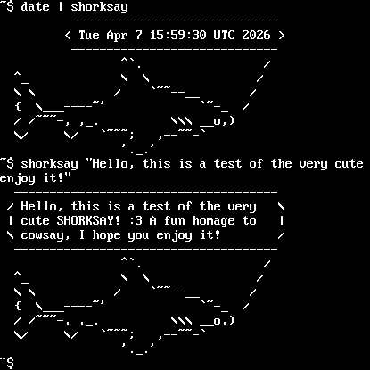

# shorksay

My cute, shark-based take on [cowsay](https://github.com/cowsay-org/cowsay) by Tony Monroe and later maintained by Andrew Janke. shorksay outputs an ASCII art shark and speech bubble containing a message of your choice. shorksay pays homage to the original, but thematically made for SHORK Operating Systems like [SHORK 486](https://github.com/SharktasticA/SHORK-486). It also works on modern Linux distributions just fine.

## Building

### Requirements

You just need a C compiler (tested with GCC with either glibc or musl).

### Compilation

Simply run `make` to compile shorksay.

### Installation

Run `make install` to install to `/usr/bin` (you may need `sudo` if not installing as root). If you want to install it elsewhere, you can override the install location prefix like `make PREFIX=/usr/local install`.

## Running

shorksay needs to be run with some sort of message. You can write it yourself or use the standard input (stdin) from another program.

### Regular input

Run `shorksay "An example message"` or `shorksay Another example message`. shorksay works with or without double quotes, but including them is advised since entering text that looks like a program argument may interfere with shorksay's operation.

### stdin input

You can use an stdin-supplied message via a pipe; for example, `fortune | shorksay`. 

### Arguments

* `-h`, `--help`: Shows help information and exits
